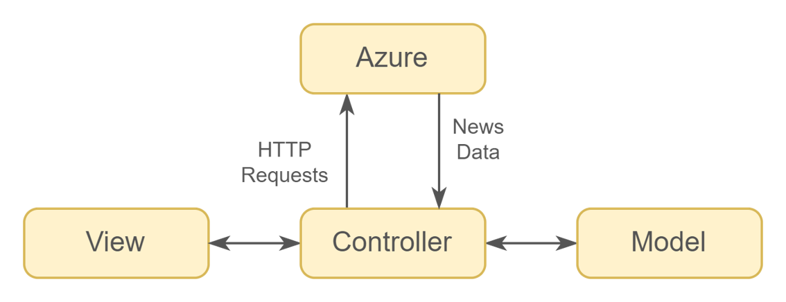
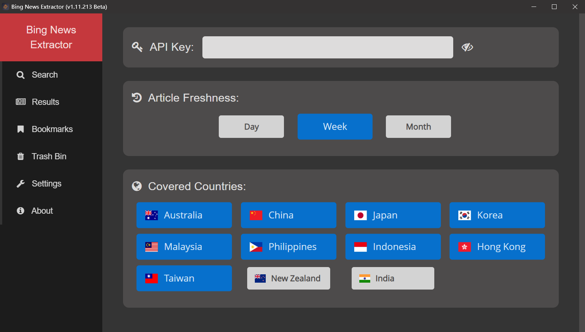
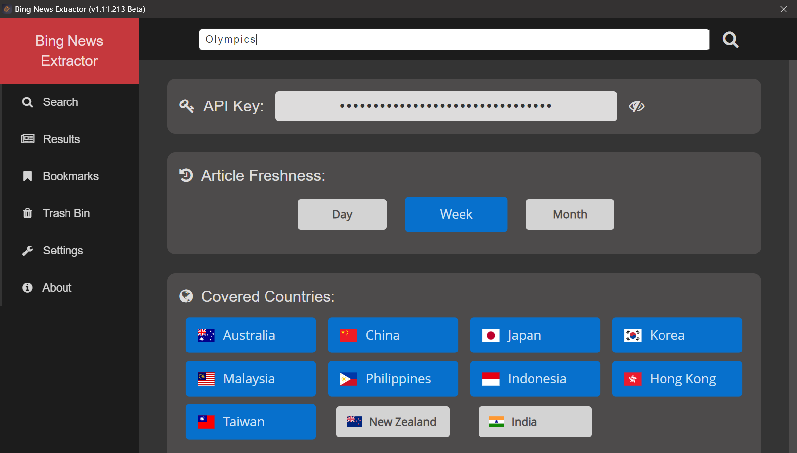
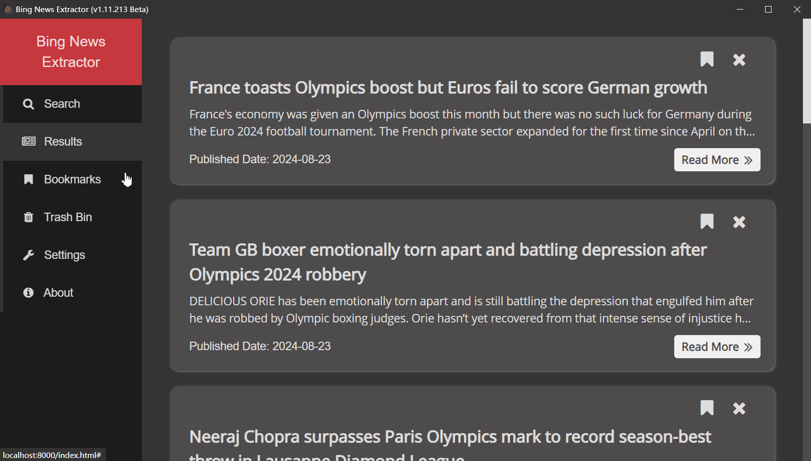

<!-- TABLE OF CONTENTS -->

   
Table of Contents

   <ol style="font-size: 1.4rem">
      <a href="#10-about-the-project">1.0 About The Project</a> 
      <a href="#20-built-with">2.0 Built With</a> 
      <a href="#30-how-it-works">3.0 How It Works</a> 
      <a href="#40-installation-windows">4.0 Installation (Windows)</a> 
      <a href="#50-usage">5.0 Usage</a> 
   </ol>

# 1.0 About The Project

This project focused on creating a desktop application using the EEL Python library, which helps in making simple Electron-like HTML/JS GUI applications. The application is built to work independently without needing server deployment allowing it to operate on any laptop device.

It connects with Microsoft Azure's Bing News Search API to gather news articles based on countries, timeframes and subjects. The collected news information is then displayed through a user interface that offers summaries and visual representations. This approach is crafted to assist business professionals and other non-technical users in accessing organising and analysing news.

The project highlights the importance of making complex news data easily accessible by bridging the gap between data retrieval technologies and practical user requirements. By offering a way to interact with news content, the application helps users stay informed and identify business opportunities.

# 2.0 Built With

[![HTML][HTML.com]][HTML-url]
[![CSS][CSS.com]][CSS-url]
[![JavaScript][Javascript.com]][Javascript-url]
[![JQuery][JQuery.com]][JQuery-url]
[![Bootstrap][Bootstrap.com]][Bootstrap-url]
[![Sqlite][Sqlite.com]][Sqlite-url]
[![Python][Python.com]][Python-url]
[![Jinja][Jinja.com]][Jinja-url]
[![MarkDown][Markdown.com]][Markdown-url]
[![Azure][Azure.com]][Azure-url]

# 3.0 How It Works

The EEL library with Model-View-Controller (MVC) architecture is applied for project implementation. The controller is implemented using both Python and JavaScript. The following graph shows the basic structure of communication between components.

# 4.0 Installation (Windows)

1. Generate a Bing API: Follow the steps in the following video (first 6 minutes): 
   https://www.youtube.com/watch?v=gqMwGVvZMDY
2. Download the application: 
   <strong>Method 1: (Packaged Application)</strong> 
   &nbsp;&nbsp;&nbsp;&nbsp;a. Download and unzip the "Bing News Scraper (Beta).zip" from the following link: 
   &nbsp;&nbsp;&nbsp;&nbsp;&nbsp;&nbsp;&nbsp;&nbsp;https://drive.google.com/file/d/1T2CVuHnzbKNYxOgXzU7AFiTrs8CHMEM2/view?usp=sharing 
   &nbsp;&nbsp;&nbsp;&nbsp;b. Double click on "Bing News Scraper (Beta).exe" 
   <strong>Method 2: (Source Code)</strong> 
   &nbsp;&nbsp;&nbsp;&nbsp;a. Download the source code 
   &nbsp;&nbsp;&nbsp;&nbsp;b. Go to the terminal 
   &nbsp;&nbsp;&nbsp;&nbsp;c. Run "Python main.py"

# 5.0 Usage

1. Settings -> Enter your API key -> Choose article freshness -> Choose countries
   

   
   

2. Left click on "Search" -> Type in a keyword -> Click on the "search" icon
   

   
   

3. Left click on "Results" to refresh and see the results
   

   
   

<!-- Links -->

[HTML.com]: https://img.shields.io/badge/HTML-239120?style=for-the-badge&logo=html5&logoColor=white
[HTML-url]: https://html.spec.whatwg.org/multipage/
[CSS.com]: https://img.shields.io/badge/CSS-239120?&style=for-the-badge&logo=css3&logoColor=white
[CSS-url]: https://www.w3.org/Style/CSS/
[Javascript.com]: https://img.shields.io/badge/JavaScript-F7DF1E?style=for-the-badge&logo=javascript&logoColor=black
[Javascript-url]: https://developer.mozilla.org/en-US/docs/Web/JavaScript
[Bootstrap.com]: https://img.shields.io/badge/Bootstrap-563D7C?style=for-the-badge&logo=bootstrap&logoColor=white
[Bootstrap-url]: https://getbootstrap.com
[JQuery.com]: https://img.shields.io/badge/jQuery-0769AD?style=for-the-badge&logo=jquery&logoColor=white
[JQuery-url]: https://jquery.com
[Python.com]: https://img.shields.io/badge/Python-14354C?style=for-the-badge&logo=python&logoColor=white
[Python-url]: https://www.python.org/
[Sqlite.com]: https://img.shields.io/badge/SQLite-07405E?style=for-the-badge&logo=sqlite&logoColor=white
[Sqlite-url]: https://www.sqlite.org/index.html
[Markdown.com]: https://img.shields.io/badge/Markdown-000000?style=for-the-badge&logo=markdown&logoColor=white
[Markdown-url]: https://daringfireball.net/projects/markdown/
[Azure.com]: https://img.shields.io/badge/azure-%230072C6.svg?style=for-the-badge&logo=microsoftazure&logoColor=white
[Azure-url]: https://www.microsoft.com/en-us/bing/apis/bing-news-search-api
[Jinja.com]: https://img.shields.io/badge/jinja-white.svg?style=for-the-badge&logo=jinja&logoColor=black
[Jinja-url]: https://jinja.palletsprojects.com/en/3.1.x/
